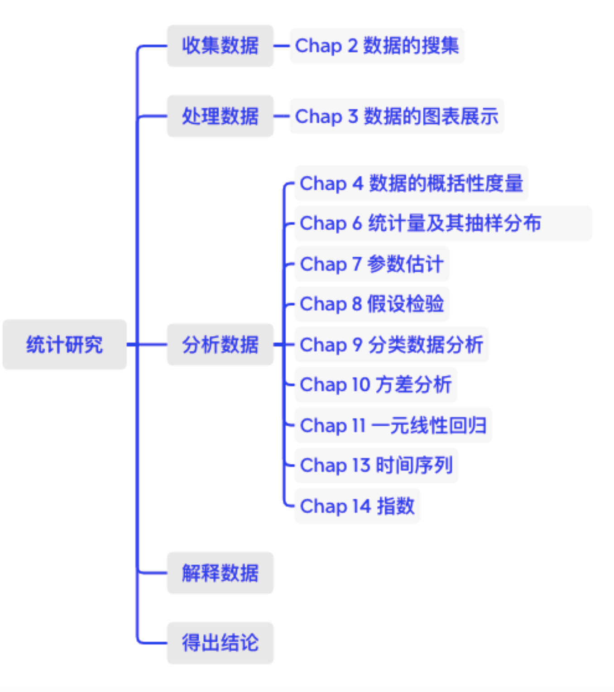
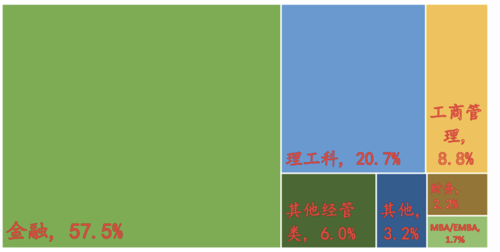
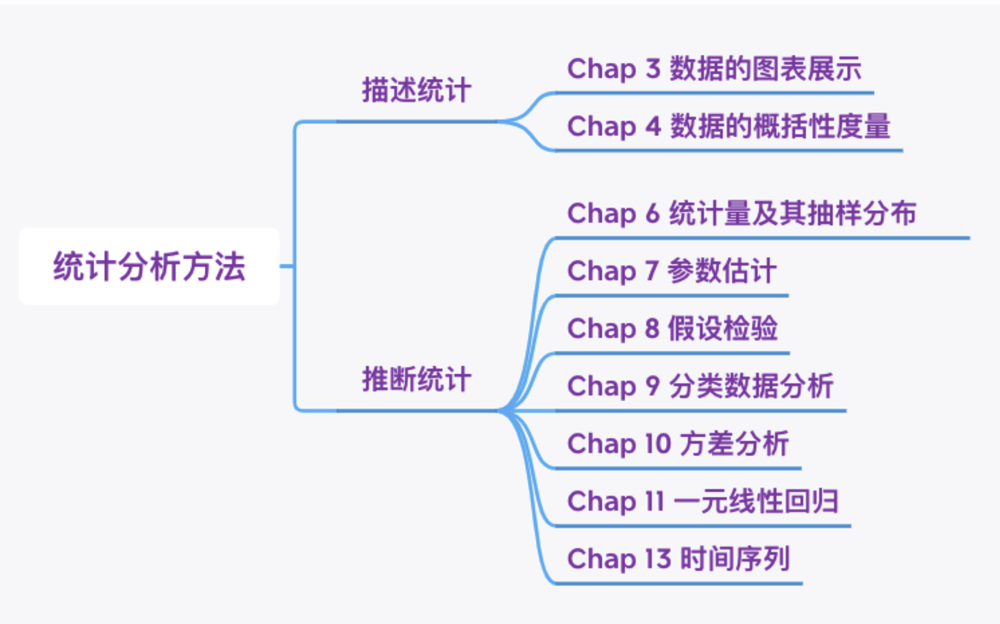
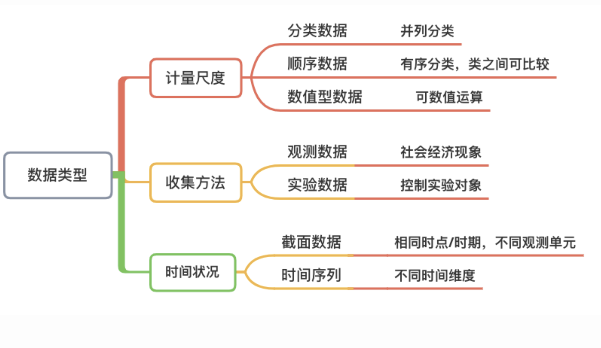
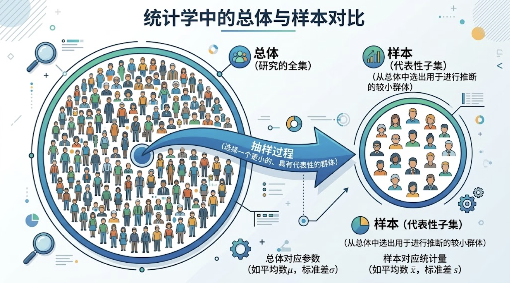

```{r setup, include=FALSE}
knitr::opts_chunk$set(echo = TRUE,comment="")
```


```{r}
#| include: false
# 指定图形的中文字体
par(family  = 'STKaiti')
#install.packages("showtext")
library(showtext)
showtext_auto()
```


---

# 1.1 什么是统计学？ 

---

## Statistics

- 统计学是**收集**、**处理**、**分析**、**解释**数据并从数据中得出结论的科学。

---

## 统计分析步骤

{width=45% fig-align="center"}

---


### 应用举例：基金经理特征分析

- 性别？
- 年龄？
- 学历？
- 专业？

---

- 从业经历？
- 海外经历？
- 资格证书？
  - Chartered Financial Analyst (CFA)
  - Financial Risk Manager (FRM)
- 业绩表现？

---

### 基金经理特征——收集数据

- 问卷调查
- 数据库
  - CSMAR
  - RESSET
- 数据库的使用：研究期间、数据范围、字段含义、数值代码

---

### 基金经理特征——处理数据

- 整理数据
- 图表展示
  - 性别分布

::: {.columns}
::: {.column width="50%"}
**性别分布示例**

- 男性：75%
- 女性：25%
:::
::: {.column width="50%"}
```{r}
#| echo: false
#| fig-height: 4
pie(c(75, 25), 
    labels = c("男性 75%", "女性 25%"), 
    col = c("#2E86AB", "#A8DADC"),
    main = "性别分布")
```
:::
:::

---

### 学历分布

| 学历   | 人数 | 百分比 |
|--------|------|--------|
| 博士后 | 2    | 0.3%   |
| 博士   | 53   | 8.8%   |
| 硕士   | 521  | 86.8%  |
| 本科   | 24   | 4.0%   |
| **总计** | **600** | **100%** |

---

### 专业背景分布

- 金融：57.5%
- 理工科：20.7%
- 工商管理：8.8%
- 其他经管类：6.0%
- 其他：3.2%
- 财务：2.2%
- MBA/EMBA：1.7%

---

### 专业背景分布

{width=45% fig-align="center"}


---

### 毕业院校 & 持有证书

::: {.columns}
::: {.column width="50%"}
**毕业院校**

| 毕业院校 | 比重  |
|----------|-------|
| 985高校  | 58.8% |
| 211高校  | 73.0% |
| 海外求学 | 17.0% |
:::
::: {.column width="50%"}
**持有证书**

| 持有证书 | 比重 |
|----------|------|
| CFA      | 5.7% |
| FRM      | 1.3% |
| CPA      | 1.2% |
:::
:::

---

### 从业年限分布

```{r}
#| echo: false
#| fig-height: 5
years <- c("0-5", "5-10", "10-15", "15-20", "20-25", ">25")
counts <- c(20, 235, 226, 73, 24, 4)
barplot(counts, names.arg = years, 
        col = "#5DADE2", border = NA,
        main = "从业年限分布",
        ylab = "人数", xlab = "从业年限（年）",
        ylim = c(0, 250))
text(x = 1:6 * 1.2 - 0.5, y = counts + 10, labels = counts, col = "red")
```

---

## 分析数据

- **描述统计**
- **推断统计**

- 单个变量：集中趋势和离散程度
- 两个变量：独立性检验、方差分析、相关和回归分析

---

### 统计分析方法分支

{width=45% fig-align="center"}

---

## 解释数据 & 得出结论

- 对统计分析结果进行解释，提炼有价值的结论。
- 结论：**不是显而易见的**，能体现统计分析的价值。


# 1.2 统计数据的类型

## 统计数据的类型

**1.2.1** 分类数据、顺序数据、数值型数据

**1.2.2** 观测数据和实验数据

**1.2.3** 截面数据和时间序列数据

---

## 数据类型

{width=45% fig-align="center"}

---

## 按计量尺度划分

- **分类数据** (nominal data)
- **顺序数据** (ordinal data)
- **数值型数据** (numeric data)

<br>

- 定性数据：qualitative data
- 定量数据：quantitative data

---

## 数据类型和数字代码

- 性别：男 = 0，女 = 1
- 学历：小学 = 1，初中 = 2，高中 = 3，大学 = 4
- 受教育年限（数值型）

::: {.callout-note}
数字代码本身不代表数量大小（分类/顺序数据），只有数值型数据可以进行数学运算。
:::

---


## 对比

定性变量说明事物的**品质特征**，结果表现为类别；定量变量说明现象的**数值特征**，结果表现为具体的数字度量。

---

| 维度 | 定性变量（分类变量） | 定量变量（数值变量） |
| :--- | :--- | :--- |
| **本质属性** | 品质特征（属于哪一类） | 数量特征（有多少/多大） |
| **主要子类** | - **无序分类**：类别无先后（如：行业、性别）<br>- **有序分类**：类别有高低（如：满意度） | - **离散变量**：取值有限可列举（如：汽车产量）<br>- **连续变量**：区间内连续取值（如：温度、年龄） |
| **典型取值** | “制造业”、“通过”、“男/女”、“很好” | 20万元、38.5℃、1000台 |
| **数学运算** | 不能进行加、减、求平均等算术运算 | 可直接进行加、减、乘、除及求均值等运算 |
| **常用统计方法** | 频数（频率）分布、列联表、卡方检验 | 计算均值、方差、做参数估计与假设检验 |

---

::: {.callout-tip}
## 能否做“有意义的加减运算”？
拿到一个变量时，不要先看它是不是用数字表示的，先问自己一个问题：**“把这些取值加起来算个平均值，在业务上具备现实意义吗？”**
- **如果毫无意义**（例如算身份证号或工号的均值）：属于**定性变量**。
- **如果有实际意义**（例如计算平均月薪或平均气温）：属于**定量变量**。
:::

---

::: {.callout-warning}
## 初学者三大易错点避坑指南

### 数字编码陷阱（以数字形态出现的分类变量）
* **错误认知**：“只要是用数字记录的数据，就是定量变量。”
* **真相**：调查问卷中常把“性别”编码为 `1 = 男, 2 = 女`；把员工评级编为 `1 = 初级, 2 = 中级, 3 = 高级`。这里的 `1` 和 `2` 仅仅是文字类别的**数字代码（代号）**。计算 `1 + 2 = 3` 或算性别的平均值是没有任何实际意义的，它们依然是**定性变量**。
* **典型实例**：身份证号、电话号码、邮政编码、足球队员球衣号码（如 10 号球衣不代表比 7 号球衣高出 3 个单位）。

---

### 有序变量误当定量变量（李克特量表陷阱）
* **错误认知**：“满意度评分为 1 到 5 分，可以当成连续数值直接加减。”
* **真相**：“很满意(5分)”与“满意(4分)”之间的差距，并不能在物理上严格等同于“一般(3分)”与“不满意(2分)”之间的差距。它本质上只有**顺序（次序）关系**，没有恒定的测量单位，属于**有序分类变量（定性）**。

---

### 统计指标与变量本身的混淆
* **错误认知**：“‘企业男女比例为 1:2’是数字，所以性别是定量变量。”
* **真相**：
  * 研究的**原始变量**是员工个人的“性别”（男/女），这是**定性变量**。
  * “比例”、“占比”或“频数”是基于样本或总体**统计汇总计算出来的统计量**，不能颠倒原始变量本身的类型。
:::

---

::: {.callout-note appearance="simple"}
### 快速练习自测
尝试判断下列变量属于**定性变量**还是**定量变量**
1. 汽车车牌号（如：粤A·12345）
2. 某型号汽车的发动机排量（如：1.5L, 2.0L）
3. 汽车碰撞安全测试等级（如：五星、四星、三星）
4. 工厂每个月的实际汽车装配下线量（如：12,000台）

> *答案解析*：1、3为定性变量（分别属于无序与有序分类）；2、4为定量变量（分别属于连续与离散数值）。
:::


## 下列数据是定性数据还是定量数据？

  - 一个消费调查中鞋子的品牌
  
  - 一份试卷中答对的题数
  
  - 一篇论文评定的等级
  
  - 一篮球队员球衣上的数字

---

## Scales of Measurement 计量尺度

- **Nominal Scale 分类尺度**
  - 是/否，包含的信息最少
- **Ordinal Scale 顺序尺度**
  - 是/否，比较大小，但不能量化差异
  
---
  
- **Interval Scale 间隔尺度**
  - 0 代表的是刻度上的一点，如温度
  - 减法运算，可以量化差异
- **Ratio Scale 比率尺度**
  - 0 代表没有
  - 可以进行减法、除法运算

---

## 数据类型示例

| Car                  | Size    | Cylinders | City MPG | Highway MPG | Fuel     |
|----------------------|---------|-----------|----------|-------------|----------|
| Audi A8              | Large   | 12        | 13       | 19          | Premium  |
| BMW 328Xi            | Compact | 6         | 17       | 25          | Premium  |
| Cadillac CTS         | Midsize | 6         | 16       | 25          | Regular  |
| Chrysler 300         | Large   | 8         | 13       | 18          | Premium  |
| Ford Focus           | Compact | 4         | 24       | 33          | Regular  |
| Hyundai Elantra      | Midsize | 4         | 25       | 33          | Regular  |
| Jeep Grand Cherokee  | Midsize | 6         | 17       | 26          | Diesel   |
| Pontiac G6           | Compact | 6         | 15       | 22          | Regular  |
| Toyota Camry         | Midsize | 4         | 21       | 31          | Regular  |
| Volkswagen Jetta     | Compact | 5         | 21       | 29          | Regular  |


---

## 截面数据

- **定义**：截面数据（Cross-sectional data）是在**相同或近似相同的时间点**上收集的数据。
- **特点**：数据通常是在**不同的空间（或不同个体）**上获得的，用于描述现象在某一特定时刻的状态、分布及差异。
- **与时间序列的区别**：
  - **截面数据**：同一时点，多个个体（横向对比，侧重空间分布）。
  - **时间序列数据**：同一个体，不同时间（纵向追踪，侧重发展趋势）。

---

## 截面数据举例

1. **宏观经济**：2023年我国各省份的地区生产总值（GDP）和人均可支配收入。
2. **企业财务**：某交易日收盘时，所有沪深300成分股的市盈率（PE）与换手率。
3. **社会调查**：某次问卷中，1000位受访者在接受调查当下的年龄、文化程度和消费满意度。

---

## 截面数据结构示例

| 地区 (个体/空间) | 时间 | GDP (亿元) | 人均可支配收入 (元) |
| :--- | :--- | :--- | :--- |
| 广东省 | 2023年 | 135,673 | 49,327 |
| 江苏省 | 2023年 | 128,222 | 52,674 |
| 山东省 | 2023年 | 92,069 | 39,890 |
| 浙江省 | 2023年 | 82,553 | 63,830 |

::: {.callout-tip}
## 提示
时间固定在“2023年”，变化的是“不同地区”
:::

---

## 截面数据示例 

```{r}
#| label: fig-cross-section
#| fig-cap: "2023年部分地区人均可支配收入对比（截面数据示例）"
#| warning: false
#| message: false

library(ggplot2)

# 构建截面数据集
df_cross <- data.frame(
  region = c("广东", "江苏", "山东", "浙江"),
  year = 2023,
  income = c(49327, 52674, 39890, 63830)
)

# 绘制柱状图直观展示个体间的差异
ggplot(df_cross, aes(x = reorder(region, income), y = income, fill = region)) +
  geom_col(width = 0.5, show.legend = FALSE) +
  coord_flip() +
  labs(
    title = "2023年各地区人均可支配收入对比",
    x = "地区",
    y = "人均可支配收入 (元)"
  ) +
  theme_minimal()
```

---

## 时间序列

- **定义**：时间序列数据（Time Series Data）是在**不同时间**收集到的数据。
- **特征**：这类数据是**按时间先后顺序**排列和记录的，主要用于观察和描述现象随时间推移而发生的变化情况与演变趋势。
- **与截面数据的区别**：
  - **时间序列数据**：同一个体/对象，在不同的时间点追踪观察（纵向对比，侧重时间趋势）。
  - **截面数据**：同一或近似时间点，多个不同个体/对象（横向对比，侧重空间分布）。

---

## 时间序列实例

- **宏观经济**：2010—2023年我国各年份的国内生产总值（GDP）、年度居民消费价格指数（CPI）。
- **金融市场**：某只股票过去一年中每个交易日的日收盘价与成交量。
- **商业运营**：某电商平台过去24个月每月的产品总销售额。
- **气象监测**：某地气象监测站连续30天记录的日最高气温。

---

## 数据结构示例

| 年份（时间序列） | 国内生产总值 GDP（亿元） | 比上年增长（%） |
| :--- | :--- | :--- |
| 2018年 | 919,281 | 6.75 |
| 2019年 | 986,515 | 5.95 |
| 2020年 | 1,013,567 | 2.24 |
| 2021年 | 1,149,237 | 8.45 |
| 2022年 | 1,204,724 | 2.99 |
| 2023年 | 1,260,582 | 5.20 |


::: {.callout-tip}
## 提示
观测对象固定为我国经济总量，记录时间按自然年度依次排列。
:::

---

## 可视化分析示例 

在时间序列分析中，通常使用**折线图（Line Chart）**来呈现随时间推移的动态波动与发展趋势。

```{r}
#| label: fig-timeseries
#| fig-cap: "2018—2023年我国GDP变化趋势（时间序列示例）"
#| warning: false
#| message: false

library(ggplot2)

# 构建时间序列数据集
df_ts <- data.frame(
  year = 2018:2023,
  gdp = c(919281, 986515, 1013567, 1149237, 1204724, 1260582)
)

# 绘制折线趋势图
ggplot(df_ts, aes(x = year, y = gdp / 10000)) +
  geom_line(color = "#1f77b4", linewidth = 1.2) +
  geom_point(color = "#1f77b4", size = 3) +
  scale_x_continuous(breaks = 2018:2023) +
  labs(
    title = "2018—2023年国内生产总值（GDP）增长走势",
    x = "年份",
    y = "GDP (万亿元)"
  ) +
  theme_minimal()
```

---

## 数据类型 → 分析方法

- **单个变量**：定量数据 or 定性数据？
- **两个变量**：
  - 定性数据 & 定性数据 → Chap 9
  - 定性数据 & 定量数据 → Chap 10
  - 定量数据 & 定量数据 → Chap 11


# 1.3 基本概念

## 基本概念

- 总体
- 样本
- 参数
- 统计量

---

## 总体和样本

**总体 (population)**

- 所研究的全部个体的集合。总体中的每一个个体也称为**元素**。
- **有限总体**：范围能够明确确定，且元素的数目是有限的。
- **无限总体**：所包括的元素是无限的，不可数的。

---

**样本 (sample)**

- 从总体中抽取的一部分元素的集合。
- 样本是总体的**子集**。
- 样本容量或样本量 (sample size)

---


## 总体和样本

{width=45% fig-align="center"}


---

## 参数和统计量

**参数 (parameter)**

- 描述**总体**特征的概括性数字度量。
- **常数**

**统计量 (statistic)**

- 描述**样本**特征的概括性数字度量。
- **随机变量**

---

## 总体与样本的对应关系

| 总体参数 | 含义   | 样本统计量 |
|----------|--------|------------|
| $\mu$    | 平均数 | $\bar{x}$  |
| $\sigma$ | 标准差 | $s$       |
| $\pi$    | 比例   | $p$       |

---

## 例题

某大学的一位研究人员希望估计该大学本科生平均每月的生活费支出，为此，他调查了200名学生，发现他们的每月平均生活费支出是600元。

- **总体**？
- **样本**？
- **参数**？
- **统计量**？

---

::: {.fragment}
**答案**：
- 总体：该大学全部本科生的每月生活费支出

- 样本：调查的200名学生的每月生活费支出

- 参数：全体本科生平均每月生活费支出（未知）

- 统计量：样本平均每月生活费支出 = 600元
:::

---

## 练习：以下数据是离散的还是连续的？

1. 步行1公里所用的时间。
2. 日历年中的年份（如2016, 2017, 2018）
3. 农场中奶牛的数量。
4. 农场中奶牛的产奶量。

---

## 贝壳二手房示例：可提取哪些数据？数据类型？

- 房屋户型、建筑面积、朝向、装修情况、楼层……
- 挂牌时间、交易权属、房屋年限……
- 小区均价、建筑年代、建筑类型……

::: {.callout-important}
思考：哪些是分类数据？顺序数据？数值型数据？截面还是时间序列？
:::


# 课程概况

- 课程目标
- 教学形式
- 学习方法
- 考核方式

---

## 课程目标

- 统计方法的运用
- 统计直觉、批判性思维
- 软件操作：Excel / SPSS / R

---

## 教学形式

- 新课
- 课堂练习
- 课后作业：上机（EXCEL\R）+ 手工计算，个人独立完成
- 案例：小组完成，4次案例作业，期末课堂汇报
- 小测验

---

## 学习方法

- 课堂效率
- 主动参与
  - 个人作业
  - 小组作业
  - 知识拓展：多元统计
  - 同老师交流
- 兴趣 + 实践

---

## 学术竞赛

- “原来后浪们都在B站学习”——大学生B站学习满意度影响因素研究  

- “疫情停课不停学，教育变更不变质”——大学生“云”课堂学习效果和满意度影响因素分析  

---

## 参考教材

- 《商务与经济统计》（原书第13版）F712.3/45  
  （美）戴维 R. 安德森 等，机械工业出版社 2017

- *Statistics for Business and Economics* F222/15/E.8  
  David R. Anderson, China Machine Press, 2003


---

## 第1章重点

- **数据类型**：
  - 分类 / 顺序 / 数值型数据
  - 时间序列 / 截面数据
- **总体 / 样本**
- **参数 / 统计量**


